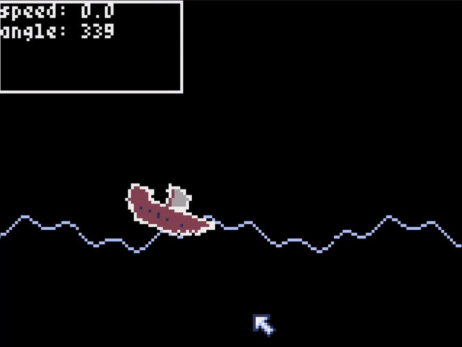

# Brackeys Game Jam 2024.2 Entry

A game made for [Brackeys Game Jam 2024.2](https://itch.io/jam/brackeys-12).  
I decided to spend exactly **1 hour** during each day of the jam as a challenge *(not counting the upload)* and document my progress for each day.

The game was created using Python and [Pyxel](https://github.com/kitao/pyxel?tab=readme-ov-file).

---

## Daily Progress

### 2024-09-08

The main idea was to create a game about the ship that carries packages throu the sea. You have to travel as fast as you can and not to get wrecked on the waves. 

Managed to implement simple sea mechanics and the ship that "floats" on it.

### 2024-09-09

Decided to have a different aproach to the player character. It will be the surfer that jumps on the waves. 

Managed to implement a simple surfboard floating mechanics with 3 points of collision. The board now stays above the waves with all 3 of them and moves down if they are not in the contact. 

### 2024-09-10
???

### 2024-09-11
???

### 2024-09-12
???

### 2024-09-13
???

### 2024-09-14
???
